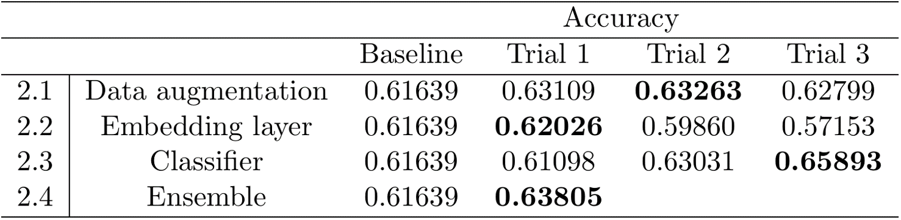

# About this repository
This repository is created for store, record POSTECH DL Project - Sentimeter(Group 20)

# To revisit the experiments

## 0. Baseline
- `data` in [./Bert-Tutorial/data/](https://github.com/cieske/POSTECH_DL_Sentimeter/tree/main/data/augmented)
- `experiment` in [./Bert-Tutorial/Bert-custom_linear.ipynb](https://github.com/cieske/POSTECH_DL_Sentimeter/blob/main/Bert-Tutorial/Bert-custom_linear.ipynb)

## 1. Data Augmentation
- `data` in [./data/augmented/](https://github.com/cieske/POSTECH_DL_Sentimeter/tree/main/data/augmented)
- `augmentation` in [./data_augmentation](https://github.com/cieske/POSTECH_DL_Sentimeter/blob/main/data_augmentation/translation_aug.ipynb)
- `experiment with augmented data` in [./Bert-Tutorial/Bert-custom-augment.ipynb](https://github.com/cieske/POSTECH_DL_Sentimeter/blob/main/Bert-Tutorial/Bert-custom-augment.ipynb)

## 2. Embedding layer
- `data` in 
- `trial 1` in 
- `trial 2` in 
- `trial 3` in [./Bert-Tutorial/Bert-TEST.ipynb](https://github.com/cieske/POSTECH_DL_Sentimeter/blob/main/Bert-Tutorial/Bert-TEST.ipynb)

## 3. Classifier
- `data` in [./Bert-Tutorial/data/](https://github.com/cieske/POSTECH_DL_Sentimeter/tree/main/data/augmented)
- `trial 1` in 
- `trial 2` in 
- `trial 3` in [./Bert-Tutorial/Bert-TEST.ipynb](https://github.com/cieske/POSTECH_DL_Sentimeter/blob/main/Bert-Tutorial/Bert-TEST.ipynb)

## 4. Ensemble 
- `data` in 
- `experiment` in 

# Reference papers we read
* [Fine-grained Sentiment Classification using BERT](https://arxiv.org/pdf/1910.03474.pdf) (AITB'19)
* [Convolutional Neural Networks with Recurrent Neural Filters](https://arxiv.org/pdf/1808.09315) (EMNLP'18)
* [Deep contextualized word representations](https://arxiv.org/pdf/1802.05365) (NAAAL'18)
* [Convolutional Neural Networks for Sentence Classification](https://arxiv.org/pdf/1408.5882) (EMNLP'14)
* [A multi-sentiment-resource enhanced attention network for sentiment classification](https://arxiv.org/pdf/1807.04990) (arXiv preprint arXiv:2018)
* [Self-Explaining Structures Improve NLP Models](https://arxiv.org/pdf/2012.01786) (arXiv preprint arXiv:2020)

* [Bag of Tricks for Efficient Text Classification](https://arxiv.org/pdf/1607.01759.pdf) (arXiv preprint arXiv:2016)
* [Convolutional Neural Networks for Sentence Classification](https://www.aclweb.org/anthology/D14-1181) (EMNLP'14)
* [Recurrent Neural Network for Text Classification with Multi-Task Learning](https://www.ijcai.org/Proceedings/16/Papers/408.pdf) (IJCAI'16)
* [Feed-Forward Networks with Attention Can Solve Some Long-Term Memory Problems](https://arxiv.org/pdf/1512.08756.pdf) (arXiv preprint arXiv:2015)
* [Recurrent Convolutional Neural Networks for Text Classification](https://www.aaai.org/ocs/index.php/AAAI/AAAI15/paper/view/9745/9552) (AAAI'15)
